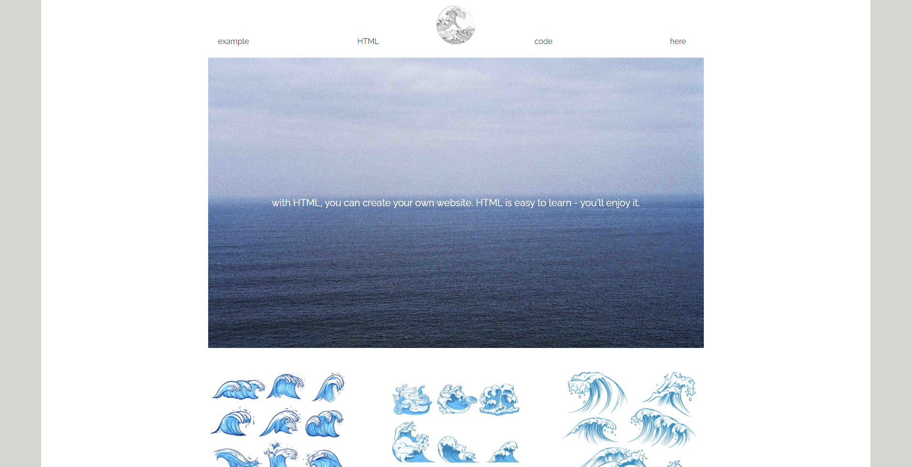

In this repository you can find html file, css file as well as images for this page.

Here is the code for a one page cross platform rubber site.
The code is completely written in html and css.
Also, everything was written as simply as possible, for better understanding.
All coding standards were taken into account.

Below I will give examples of the main page of this site:

