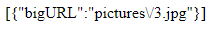

In this repository you can see a snippet of php code from a real microservices project, balances and product characteristics.

The code conforms to all language standards and also applies OOP.
For confidentiality purposes, the name and password from the database were kept secret.
Also in the code you can see 2 examples of writing database queries.

Using a get request, if the word "iPhone" is in the url of the page, then this jsoncode will be displayed:\n
\n

Similar to "img":\n

If you also add the js code, then you can observe the further situation:

On the first request, we get a table with the name and price of the product.
With the help of the second request, we get the url of the image that suits us.
All this data is converted to json. Next, by adding js code, we can convert the json data (using date tables) 
into a table and extract the content we need from it.
As a result, we get:

